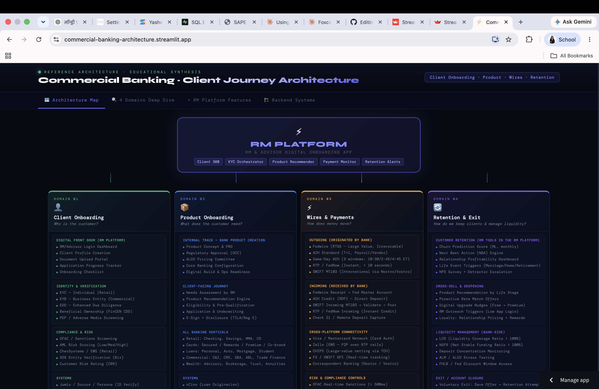

# Commercial Banking — Client Journey Architecture

**An interactive reference architecture of a modern commercial bank's client journey — the four domains that structure the work, the RM-facing platform that sits on top, and the vendor stack that powers it.**

🔗 **[Live App](https://commercial-banking-architecture.streamlit.app/)** · Built with React + Streamlit



> Educational synthesis. All content is built from publicly available sources — vendor documentation (Salesforce Financial Services Cloud, FIS, Jack Henry, Actimize), analyst reports on banking architecture, and public regulatory disclosures (RBI, FinCEN, OFAC). Not affiliated with, endorsed by, or representative of any specific bank's internal systems.

---

## Why I built it

Commercial banking looks intimidating from the outside — dozens of systems, unfamiliar acronyms (CBS, LOS, KYB, EDD), and integrations that don't map to any familiar product. When I started studying banking architecture in the FORE PGDM (Big Data Analytics) programme, the fastest way for me to understand it was to draw it. This repo is that drawing, made interactive so someone else can navigate it in ten minutes instead of reading a hundred pages of vendor whitepapers.

The mental model I found most useful: **banking is e-commerce, just for money instead of goods.** Every backend system in a bank has a Flipkart / Amazon equivalent. Once you see that mapping, the vendor names stop being scary — a Loan Origination System is just an OMS, a Payment Hub is just a Payment Gateway, Salesforce FSC is just a CRM tuned for financial products. The final tab makes that mapping explicit.

---

## What it does

| Tab | Purpose |
|---|---|
| **Architecture Map** | Full block diagram showing the RM Platform at the top, the four client-journey domains in the middle, and the integrated backend systems below. Colour-coded by domain. |
| **4 Domains Deep Dive** | Click into each of the four domains — Client Onboarding, Product Onboarding, Wires & Payments, Retention & Exit — to see its layers: the RM-facing screens, the verification and compliance systems, the underlying data platforms. |
| **RM Platform Features** | The six capabilities every modern RM platform needs: Client Profile Hub (360° view), Onboarding Orchestrator, Product Recommendation, Payment Monitor, Retention Alerts, and Relationship P&L. |
| **Backend Systems** | The e-commerce ↔ banking mental model. Flipkart CRM → Salesforce FSC. Flipkart OMS → Loan Origination System. Flipkart Payment Gateway → Payment Hub (Fedwire / ACH / SWIFT). And so on across twelve mappings. |

---

## The four domains

```
CLIENT JOURNEY  (left to right)
─────────────────────────────────────────────────────────────────────────
  01 Client Onboarding    →   02 Product Onboarding   →   03 Wires & Payments   →   04 Retention & Exit
  Who is the customer?         What do they need?           Move their money            Keep them, or exit cleanly
  KYC · KYB · EDD              Deposit · Loan · Card        ACH · Wire · SWIFT          Churn alerts · Complaint queue
  FinCEN CDD · PEP · OFAC      Underwriting · Pricing       FX · Real-time payments     Life-event triggers · Exit
```

Under each domain, the diagram shows three layers:

1. **Digital Front Door** — the screens the Relationship Manager (RM) actually uses.
2. **Identity & Verification / Product Logic / Payment Rails / Retention Signals** — the domain-specific processing layer.
3. **Systems of Record** — where the data lives (core banking, CRM, ERP, data platform).

---

## The vendor stack (all publicly documented)

| Category | Common vendors |
|---|---|
| Core Banking System (CBS) | FIS, Jack Henry, Temenos, Finacle |
| CRM | Salesforce Financial Services Cloud, Microsoft Dynamics 365 for Financial Services |
| Loan Origination System | nCino, Salesforce LOS, Jack Henry LoanVantage |
| AML / KYC / Transaction Monitoring | NICE Actimize, SAS AML, Oracle FCCM |
| Payment Hub | ACI Universal Payments, FIS PayCenter, Volante VolPay |
| Data & Analytics | Snowflake, Databricks, Google BigQuery |
| API Gateway | Kong, Apigee, MuleSoft |

Naming these publicly does no harm — every vendor above has a public product website. What matters is understanding what each category *does* and why a bank needs all of them.

---

## Design decisions and trade-offs

| Decision | Why | Trade-off accepted |
|---|---|---|
| **React inside Streamlit, not pure React** | I wanted to deploy in 60 seconds on Streamlit Cloud with zero infrastructure, while keeping the interactive click-through experience React gives. | Slightly awkward embed; can't route between tabs via URL. |
| **Four tabs instead of one long scroll** | A recruiter or student can jump to the layer that interests them without reading everything. | State is per-session; no bookmarkable views. |
| **E-commerce analogy in Tab 4** | Domain-transfer is the fastest way to learn an unfamiliar industry. Anyone who has ordered from Amazon can grasp it instantly. | The mapping is approximate — a real payment hub is more complex than a payment gateway. Flagged as a mental model, not a spec. |
| **Named real vendors instead of "Vendor A / B / C"** | Vendor names carry information — knowing Actimize handles AML tells you something the abstract term doesn't. All are public. | Slightly dated the moment a new vendor emerges. |
| **Kept the RM-facing perspective** | Client-side and back-office views also matter, but the RM view is what makes a commercial bank distinct from a retail bank. Focus is easier to understand than a full enterprise diagram. | Consumers of retail banking apps see a different picture, not covered here. |

---

## What I'd add next

1. **Retail banking view.** A parallel diagram for the retail (consumer) side, where the Digital Front Door is a mobile app, not an RM screen.
2. **Data flow overlays.** Right now the diagram shows systems, not the events that flow between them. Overlays for the "new client" event, the "wire failed" event, and the "credit application" event would show the actual choreography.
3. **Fintech vs bank layout.** Same four domains, but showing how a neobank compresses several traditional systems into fewer components (banking-as-a-service, embedded compliance).
4. **Regulatory overlay.** Colour-code each system by the regulation it's touched by (KYC, BSA, GLBA, Reg E, TILA, PCI-DSS).

---

## Tech stack

React (via Babel standalone) · Streamlit · `streamlit.components.v1` for HTML embed · Streamlit Community Cloud

## Run locally

```bash
git clone https://github.com/kritikab01/banking_architecture.git
cd banking_architecture
pip install -r requirements.txt
streamlit run app.py
```

Opens at `http://localhost:8501`. No API keys or secrets required.

## Project structure

```
app.py                    # Streamlit wrapper that renders the HTML
architecture.html         # React app with all four tabs
requirements.txt          # streamlit
docs/screenshot-map.png   # architecture map
```

---

## My role

Individual project. I built the entire diagram end to end — the four-domain framework, the 12 e-commerce-to-banking mappings, the RM platform feature set, and the interactive React interface. Content synthesized from public sources listed above.

**Kritika Bhachawat** · [LinkedIn](https://www.linkedin.com/in/kritika-bhachawat-jain-4740ba194/) · [Portfolio](https://kritikabhachawat.me/)
